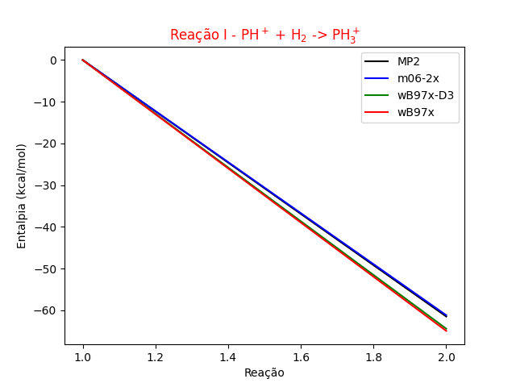

[Português](README.pt.md) | [Español](README.es.md)

[](https://www.python.org/)
[](https://matplotlib.org/)
[](https://www.acs.org/content/acs/en.html)

# Positive Phosphine Formation Report

## 📝 Description

This project was developed to provide a Positive Phosphine Formation Calculation report for Computational Chemistry. The goal is to simulate the formation reaction of positive phosphine by adding hydrogen to the positive phosphine ion. The reaction is represented by the following chemical equation:

PH<sup>+</sup> + H<sub>2</sub> → PH<sub>3</sub><sup>+</sup>

## 📊 Results

Through input data, the program calculates the positive phosphine formation energy and generates a potential energy graph as a function of the distance between phosphorus and hydrogen atoms.



## 📚 Theory

The formation energy of a compound is the energy required to form one mole of a substance from its constituent elements in the standard state. The positive phosphine formation energy is given by the difference between the product energy and the sum of the reactants' energies:

ΔH<sub>f</sub> = E(PH<sub>3</sub><sup>+</sup>) - E(PH<sup>+</sup>) - E(H<sub>2</sub>)

where:
- ΔH<sub>f</sub> is the positive phosphine formation energy
- E(PH<sub>3</sub><sup>+</sup>) is the product energy (positive phosphine)
- E(PH<sup>+</sup>) is the reactant energy (positive phosphonium)
- E(H<sub>2</sub>) is the reactant energy (hydrogen)

## 🔄 Process

The project has scripts to perform calculations and generate graphs.
* **parametros.py** - contains the program's input parameters.
* **calculos.py** - performs positive phosphine formation energy calculations and generates the potential energy graph.
* **gerar_grafico.py** - generates the potential energy graph as a function of the distance between phosphorus and hydrogen atoms.
* **gera_arquivo.py** - generates an output file with the calculation results.
* **main.py** - is the main script that calls functions from the other scripts.

## 📋 Requirements

To run the project, it is necessary to install Python and the Matplotlib library.

## 📦 Installation

To install the Matplotlib library, run the following command:

```bash
pip install matplotlib
```

## 🚀 Technologies
* [Python](https://www.python.org/)
* [Matplotlib](https://matplotlib.org/)